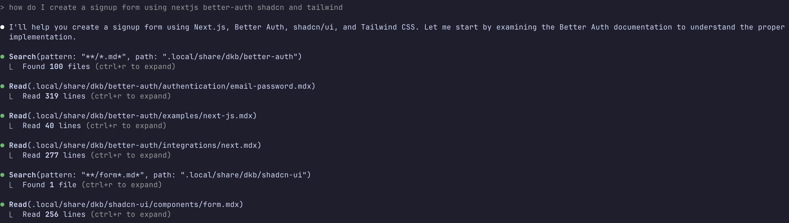

# dkb - Developer Knowledge Base

Local documentation manager for vibe coding with Claude Code.


> [!NOTE]
> ✨ **Perfect for Claude Code**
> 
> `dkb` automatically generates a `CLAUDE.md` file that provides context about your local documentation cache and `dkb` usage instructions.
> 
> ```diff
> # ~/CLAUDE.md
> + @~/.local/share/dkb/CLAUDE.md
> ```
> Now on your next Claude Code session it will know how to use it.



> Local .md files > MCP

## Install

```bash
# Install with uv
uv tool install dkb

# Or with pipx
pipx install dkb
```

## Usage

```bash
$ dkb -h
usage: dkb [-h] {add,remove,update,status,claude} ...

dkb v1.3.1

Developer Knowledge Base - Fetch and organize documentation locally for vibe coding with Claude Code

positional arguments:
  {add,remove,update,status,claude}
                        Available commands
    add                 Add a new repository
    remove              Remove a repository
    update              Update repositories
    status              Show status of all repositories
    claude              Regenerate CLAUDE.md file

options:
  -h, --help            show this help message and exit

Examples:
  dkb add https://github.com/denoland/docs.git
  dkb add tailwindlabs/tailwindcss.com/src/docs
  dkb add gramiojs/documentation/docs --version-url gramiojs/gramio
  dkb add https://github.com/astral-sh/uv/tree/main/docs
  dkb remove tailwind
  dkb update
  dkb status

# Add a repository (entire repo)
$ dkb add https://github.com/denoland/docs.git

📦 Adding docs...
   ✓ 2.4.2
   ✓ Updated /Users/you/.local/share/dkb/CLAUDE.md

# Show status with rich formatting
$ dkb status

                                    Knowledge Base Status
┏━━━━━━━━━━━━━━┳━━━━━━━━━┳━━━━━━━━━━━━━━━━━━━━━━━━━━┳━━━━━━━━━━━━━━━━━━━━━━━━━┳━━━━━━━━━━━━━━┓
┃ Repository   ┃ Version ┃ Docs                     ┃ Source                  ┃ Last Updated ┃
┡━━━━━━━━━━━━━━╇━━━━━━━━━╇━━━━━━━━━━━━━━━━━━━━━━━━━━╇━━━━━━━━━━━━━━━━━━━━━━━━━╇━━━━━━━━━━━━━━┩
│ better-auth  │ 1.2.12  │ better-auth/better-auth  │ -                       │ 25m ago      │
│ deno         │ 2.4.2   │ denoland/docs            │ denoland/deno           │ 25m ago      │
│ nextjs       │ 15.4.2  │ vercel/next.js           │ -                       │ 24m ago      │
│ tailwind     │ 4.1.11  │ tailwindlabs/tailwindcss.com │ tailwindlabs/tailwindcss │ 12m ago      │
│ uv           │ 0.8.0   │ astral-sh/uv             │ -                       │ 33m ago      │
└──────────────┴─────────┴──────────────────────────┴─────────────────────────┴──────────────┘

# Update all repositories (parallel with live progress)
$ dkb update

  ✓ deno            updated
  - nextjs          unchanged
  - tailwind        unchanged
  - uv              unchanged

Updated: deno
   ✓ Updated /Users/you/.local/share/dkb/CLAUDE.md
```

## Configuration

Docs stored in `$XDG_DATA_HOME/dkb/` (defaults to `~/.local/share/dkb/`)

Configuration file: `$XDG_DATA_HOME/dkb/config.json`

## Features

- ✨ **Auto-naming** - No need to specify names, automatically derived from repositories
- 🎯 **Path-specific URLs** - Add only the docs you need: `dkb add owner/repo/path`
- 🔗 **Multiple URL formats**:
  - Full URLs: `https://github.com/astral-sh/uv/tree/main/docs`
  - Shorthand: `tailwindlabs/tailwindcss.com/src/docs`
  - Classic: `https://github.com/denoland/docs.git`
- 📦 **Version tracking** - Track versions from a different repository with `--version-url`
- 🚀 **Parallel updates** - All repos update concurrently with live progress spinners
- ⚡ **Smart skip** - Unchanged repos detected via `git ls-remote` without cloning
- 📂 **Sparse checkout** - Repos with paths only fetch the files they need
- 🤖 **Claude Code integration** - Auto-generates CLAUDE.md for seamless AI assistance
